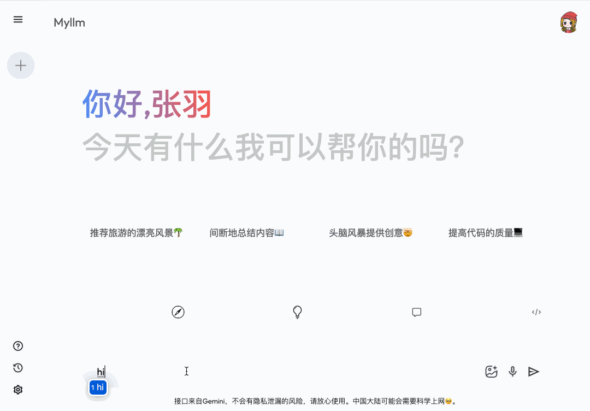
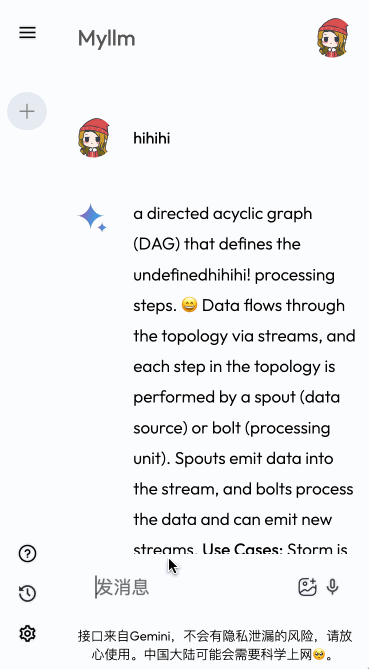

# Readme

preview: [link](https://leafy-rabanadas-ca82de.netlify.app/ "none")

[](https://leafy-rabanadas-ca82de.netlify.app/ "none")

[](https://leafy-rabanadas-ca82de.netlify.app/)
数据持久化⭕️

Gemni接口接入🟢

需要挂梯子，才能正常访问和使用

```bash
src % tree
.
├── App.jsx
├── assets #静态资源
│   ├── assets.js #静态资源接口
│   ├── bulb_icon.png
│   ├── ...
│   └── youtube_icon.png
├── components
│   ├── Main #右边的主体部分
│   │   ├── Main.css
│   │   └── Main.jsx
│   └── Sidebar #侧栏
│       ├── Sidebar.css
│       └── Sidebar.jsx
├── config
│   └── gemini.js #用来接入Gemini API
├── context
│   └── Context.jsx #公共数据状态
├── index.css #全局CSS
└── main.jsx #入口
```
